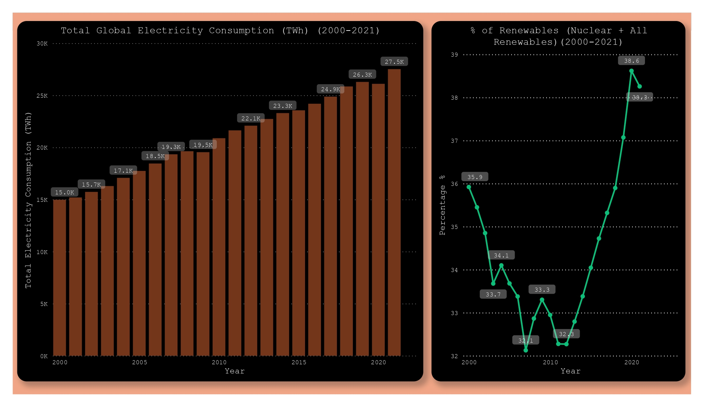
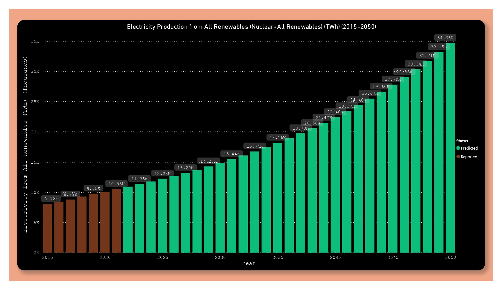

# Renewable Electricity Prediction
* Calculating Number and Area of Tesla Solar Panels needed and Number of Nuclear power plants needed to satisfy the Electricity consumption of the world in 2021
* Predicting Renewable Electricity Production till 2100 (Nuclear + All Renewables)

# Metrics Used
* 1 400W Tesla Solar Panel = 3.8KWh a day
* 1 Tesla Solar Panel = 3.8KWh * 365 
* 1 Palo Verde nuclear power plant = 3937000W * 24 * 365 KWh a year at full capacity everyday
* n = number of solar panles,nuclear plants needed to satisfy Total Electricity consumption of the world in 2021
* Area of 1 Tesla Solar Panlel =  1.995 sqm
* Total Area needed = n * area of 1 Tesla panel
* Any City Area needed =  Total Area of city / Total area of n solar panles 

# Process
* Training Different Models on the datasets mentioned below 
* choosing LinearRegrssor sine Mean Squared Error was the lowest 
* Creating a class which will predict reneable(nuclear+renewables) electricty production n number of years into the future
n can be whatever we like 

# Report
The Report is posted here Link:[]

Global Electricity consumption from 2000-2021 
% of energy thate came fron Renewables + Nuclear 

Gobal Electricty Production from 2015-2050

# Datasets 
* Gobal Electricty Consumption by source (1985-2021)
* Gobal Electricity Production by fossil fuels,nuclear and renewables (1985-2021)

Source:
Ourworldindata:https://ourworldindata.org/
